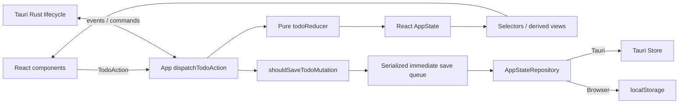
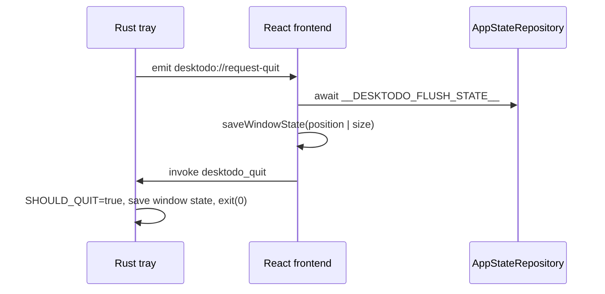

# DeskTodo Project Context

> 新开发者与 AI 代理的统一项目入口。开始分析、设计或修改代码前，请先完整阅读本文和 [AGENTS.md](AGENTS.md)，再以当前源码与测试为最终事实来源。

## 1. 文档定位

本文用于让一个没有历史对话的新开发者或 AI 在较短时间内理解 DeskTodo 的：

- 产品初衷、核心体验与明确边界；
- 当前发布状态、技术栈和运行方式；
- 领域模型、日期语义、重复任务与完成历史规则；
- React、reducer、selector、repository 和 Tauri Rust 的职责边界；
- Store 数据安全、迁移、保存队列和退出 flush 机制；
- 主要 UI 组件、设计系统和交互规范；
- 测试、构建、发布流程以及修改前后的验收要求；
- 已知限制、重要技术决策和高风险改动区域。

本文不是 API 自动生成文档，也不能替代源码。发生冲突时，优先级为：

1. 当前用户的明确要求；
2. [AGENTS.md](AGENTS.md) 的工程约束；
3. 当前测试表达的稳定行为；
4. 当前源码；
5. 本文；
6. README 和历史对话。

更新任何架构、schema、关键产品语义或原生生命周期时，应同步更新本文。

## 2. 当前基线

| 项目 | 当前值 |
| --- | --- |
| 产品名 | DeskTodo |
| 当前发布版本 | `v0.4.0` |
| 本文基线提交 | `e2e9417` |
| GitHub | <https://github.com/star0628/DeskTodo> |
| 主平台 | Windows 10/11 x64 |
| 桌面框架 | Tauri 2 |
| 前端 | React 18 + TypeScript + Vite |
| 样式 | Plain CSS + semantic design tokens |
| 单元/组件测试 | Vitest + Testing Library |
| 视觉与几何测试 | Playwright |
| 许可证 | MIT |
| 应用 identifier | `com.desktodo.desktop` |
| Store 文件 | `%APPDATA%\com.desktodo.desktop\desktodo-state.json` |
| 当前 AppState schema | `9` |

版本号必须在以下文件保持一致：

- `package.json`
- `package-lock.json`
- `src-tauri/tauri.conf.json`
- `src-tauri/Cargo.toml`
- `src-tauri/Cargo.lock` 中的本项目 package 记录

## 3. 产品初衷

DeskTodo 是一个 Windows 优先、长期放在桌面上的轻量 Todo 小组件。它不是项目管理平台，也不是日历服务或协作系统。

核心价值：

- 打开即可记录，不登录、不联网、不展示广告；
- 在一个小窗口中完成高频任务操作；
- 未完成工作自然跨日保留，已完成工作可按实际完成日期回顾；
- 可为未来日期做轻量计划，但不引入完整日历产品复杂度；
- 数据默认只保存在用户本机；
- 窗口、托盘、单实例和退出保存行为足够稳定，可作为日常桌面工具使用；
- 工程结构明确，任何状态变化和持久化行为都可测试、可审查。

### 3.1 产品原则

1. **本地优先**：Todo 数据不依赖账号、服务器或云服务。
2. **稳定优先**：数据安全和可退出性高于减少写盘次数或增加功能数量。
3. **小组件优先**：界面必须适合 `360x520` 默认窗口和 `300x280` 最小窗口。
4. **派生而非破坏**：今日、未来、历史、重要排序等视图通过 selector 派生，不通过隐式删除或重写数据实现。
5. **明确语义**：计划日期、截止时间、完成日期和重复规则是不同概念，不能静默互相改写。
6. **渐进增强**：Tauri 提供原生能力；浏览器开发模式必须有可用 fallback 或明确不可用状态。
7. **克制设计**：保持桌面工具风格，不演变成大型设置中心或复杂任务管理器。

### 3.2 明确非目标

除非用户在后续版本中明确批准，不要主动加入：

- 云同步或多设备实时同步；
- 账号、登录、团队协作；
- 通知提醒；
- 番茄钟或时间追踪；
- 多项目、标签、复杂优先级体系；
- 自然语言日期解析；
- 自动贴边隐藏；
- AI 功能、分析、遥测或埋点；
- WorkerW、Progman、SetParent 等真正桌面嵌入；
- 大型设置页或主题市场。

注意：拖拽排序、自定义主题和开机自启动已经是现有功能，不应被误判为尚未实现；不要在没有明确需求时进一步扩展它们。

## 4. 当前功能概览

### 4.1 Todo 核心

- 创建、编辑、完成/取消完成、删除一级任务；
- 创建、编辑、完成/取消完成、删除一级子任务；
- 子任务最多一层；
- 空标题不创建、不覆盖；标题统一 `trim`；
- 相同标题编辑和不存在 ID 的 action 返回原 state 引用；
- 已完成任务固定显示在待完成任务下方的折叠区域；
- 删除任务、子任务和历史记录后提供 8 秒撤销；
- 一级任务可标记重要；
- 长按任务行 220ms 后拖拽排序，5px tolerance，纵向移动；
- 父任务和子任务的拖动只能在当前排序容器内进行，不能跨状态 bucket；
- 子任务输入支持 Enter 创建、Esc 取消、点击外部保存或取消。

### 4.2 日期与历史

- 日期导航支持过去、今天和未来；
- 过去日期显示实际完成历史；
- 今天显示 backlog、已到计划日仍未完成的任务以及今天完成的任务；
- 未来日期仅显示 `scheduledFor` 精确匹配该日的一级任务；
- 今天和未来可新增、编辑任务，过去日期默认只读；
- 日历实心点表示完成记录，空心点表示计划任务；
- 过去已完成记录不会自动从 Store 删除；
- 历史删除必须进入选择模式、二次确认，并支持撤销；
- 包含未完成子任务的已完成父任务受保护，不能从历史中直接删除。

### 4.3 计划、截止时间与重复

- 一级任务可设置独立计划日期 `scheduledFor`；
- 一级子任务继承父任务的日期语义，自身 `scheduledFor` 必须为 `null`；
- 一级任务可设置 ISO 截止时间 `deadlineAt`；
- 计划日期和截止时间相互独立；
- 截止展示可选择倒计时或本地日期时间；
- 距离截止时间小于 30 分钟时按秒刷新，否则按分钟刷新；
- 支持每天、工作日、指定星期重复；
- 新重复系列可从未来计划日期开始；
- 每个重复系列最多存在一个未完成实例；
- 长时间未打开时仅生成最近一个到期实例，避免积压洪峰；
- 重复实例继承父任务标题、重要标记、一级子任务标题、相对截止模式和截止显示模式；
- 删除重复任务可选择跳过当前实例或停止整个系列。

### 4.4 搜索与数据迁移

- `Ctrl+F` 打开本地搜索；
- 搜索一级任务、一级子任务和导入的历史快照；
- 使用 Unicode NFKC、空白归一化和 `zh-CN` 小写匹配；
- 搜索可跳转到今天、未来计划日期或历史完成日期；
- 可按本地日期范围导出完成记录；
- 导出文件是格式化 UTF-8 JSON，扩展名为 `.desktodo.txt`；
- 导入前整体校验，不接受部分成功；
- 重复记录幂等跳过，来源 ID 相同但内容不同的记录作为冲突跳过；
- 导入仅恢复完成历史，不重建未完成任务、不激活重复系列、不覆盖设置；
- 每次导入 batch 可撤销。

### 4.5 外观与桌面能力

- 无边框、透明、圆角、可调整尺寸；
- 默认 `360x520`，最小 `300x280`；
- Header 空白区域支持原生拖动；
- 置顶、普通、best-effort 置底三种窗口层级；
- 五套固定主题和一套三色自定义主题；
- 字号 12–20px；
- 背景不透明度 10–100%；
- 紧凑模式、默认折叠已完成；
- Windows 开机自启动开关；
- 系统托盘显示、隐藏、退出；
- 托盘左键和双击恢复窗口；
- Header 隐藏与关闭到托盘；
- Alt+F4/窗口关闭请求隐藏到托盘；
- 单实例，二次启动恢复现有窗口；
- 保存并恢复窗口位置和尺寸；
- 默认 `skipTaskbar: true`。

## 5. 总体架构

DeskTodo 使用单向状态流。React 组件不拥有 Todo 真相，也不能直接写 Store。



四类状态必须区分：

1. **持久化领域状态**：`AppState`，通过 reducer 修改并通过 repository 保存。
2. **派生视图状态**：selector 的返回值，例如今日任务、历史记录和重要排序，不保存。
3. **UI 临时状态**：对话框开关、输入草稿、选中日期、撤销 toast、预览颜色，不写 Store。
4. **操作系统状态**：窗口 z-order、位置、尺寸、托盘、开机启动，由 Tauri/Windows 维护。

## 6. 目录与模块职责

```text
desktop-todo/
├─ src/
│  ├─ App.tsx                 应用编排、hydration、dispatch、save queue、日期视图
│  ├─ main.tsx                React 入口
│  ├─ components/             可交互 UI 与对话框
│  ├─ domain/                 纯领域模型、reducer、selector、排序、重复、截止时间
│  ├─ persistence/            schema、repository、Store/localStorage、保存策略、窗口模式
│  ├─ platform/               文件服务与 autostart 平台适配
│  ├─ transfer/               完成记录导入/导出格式和校验
│  ├─ settings/               主题目录与自定义主题颜色算法
│  ├─ hooks/                  本地日期和 deadline 时钟
│  ├─ styles/                 字体、Token、主题、全局组件样式
│  └─ utils/                  日期、ID、焦点和快捷键工具
├─ src-tauri/
│  ├─ src/lib.rs              插件、托盘、窗口生命周期、quit/store commands
│  ├─ capabilities/default.json
│  ├─ tauri.conf.json
│  ├─ Cargo.toml / Cargo.lock
│  └─ icons/
├─ tests/visual/              Playwright 视觉、几何、焦点和交互回归
├─ docs/ui-baseline/          视觉基线阶段报告
├─ .github/workflows/         Windows CI 与 GitHub Release
├─ README.md                  用户、贡献者和发布说明
├─ AGENTS.md                  代码代理硬性工程规则
└─ PROJECT_CONTEXT.md         本文
```

### 6.1 `src/domain`

| 文件 | 职责 |
| --- | --- |
| `todoTypes.ts` | AppState、Todo、重复、设置等稳定类型 |
| `todoReducer.ts` | 所有持久化状态变化的唯一入口 |
| `todoSelectors.ts` | 全量计数和子任务进度 |
| `dailyViewSelectors.ts` | 过去/今天/未来视图、日历数量、完成历史 |
| `recurrence.ts` | 重复规则规范化、下一日期、实例物化 |
| `deadline.ts` | 截止时间验证、本地转换、展示与刷新周期 |
| `todoOrdering.ts` | 重要/普通/完成 bucket 内的稳定重排 |
| `taskSearch.ts` | 本地只读搜索和排序 |
| `historyDeletion.ts` | 历史删除可用性、计划、删除和恢复快照 |

### 6.2 `src/persistence`

| 文件 | 职责 |
| --- | --- |
| `appStateSchema.ts` | 默认 state、schema v1-v9 解析/迁移、关系校验 |
| `appStateRepository.ts` | `load/save` 接口和 `LoadStatus` |
| `tauriTaskStore.ts` | Tauri Store 实现、迁移备份、文件状态保护 |
| `localTaskStore.ts` | 浏览器与单测 localStorage 实现 |
| `savePolicy.ts` | 判断 action 是否允许触发保存 |
| `index.ts` | 按运行环境选择 repository |
| `windowLayer.ts` | renderer session、latest-wins 窗口层级请求、原生 ACK 与 recovery completion |
| `windowRecovery.ts` | 窗口恢复时的模式收敛规则 |

### 6.3 `src/components`

| 文件 | 职责 |
| --- | --- |
| `AppShell.tsx` | 应用根壳、主题和字号 CSS variables |
| `Header.tsx` | 品牌、进度、窗口拖动、设置与窗口控件 |
| `DateNavigator.tsx` / `CalendarPopover.tsx` | 日期切换、日历完成/计划标记 |
| `QuickAddInput.tsx` | 今日/未来快速新增 |
| `TaskList.tsx` | 活跃/完成分组、父任务 DnD、deadline clock |
| `TaskItem.tsx` | 任务行、编辑、子任务、重要、时间安排、删除 |
| `ScheduleControl.tsx` | 计划日期、截止时间、重复三页签 |
| `DailyHistoryList.tsx` | 过去完成历史和选择删除模式 |
| `TaskSearchDialog.tsx` | 本地搜索与日期跳转 |
| `SettingsDialog.tsx` | 主题、字号、透明度、紧凑、折叠、autostart、数据 |
| `DataTransferSection.tsx` | 完成记录导入导出 UI |
| `UndoToast.tsx` | 删除和导入撤销入口 |
| `WindowLayerControl.tsx` | 置顶/普通/桌面模式循环 |
| `WindowControls.tsx` | 隐藏和关闭到托盘 |

## 7. 领域数据模型

`src/domain/todoTypes.ts` 是类型真相。当前 schema 为 9。

### 7.1 `TodoItem`

```ts
interface TodoItem {
  id: string;
  title: string;
  done: boolean;
  createdAt: string;
  updatedAt: string;
  completedAt: string | null;
  completedOn: LocalDateKey | null;
  important: boolean;
  scheduledFor: LocalDateKey | null;
  deadlineAt: string | null;
  deadlineDisplayMode: "countdown" | "dateTime";
  recurrenceSeriesId: string | null;
  children: TodoItem[];
}
```

关键不变量：

- `title` 必须是非空、trim 后的字符串；
- ID 由 `crypto.randomUUID()` 或封装 fallback 产生；
- 父任务可拥有一级 `children`；
- 子任务 `children` 必须为空；
- 子任务不得独立设置重要、计划日期、deadline 或重复系列；
- `done === true` 时应有 `completedAt` 和 `completedOn`；
- `completedOn` 是本地 `YYYY-MM-DD`，不能用 UTC 字符串截取代替；
- `scheduledFor` 是计划日期，不是完成日期；
- `deadlineAt` 是 ISO instant，编辑和展示按 Windows 本地时区；
- `recurrenceSeriesId !== null` 时必须存在计划日期和对应 series。

### 7.2 `AppState`

```ts
interface AppState {
  schemaVersion: 9;
  tasks: TodoItem[];
  archivedCompletions: ArchivedCompletionRecord[];
  recurrenceSeries: RecurrenceSeries[];
  settings: AppSettings;
}
```

- `tasks` 保存实时任务和其完成元数据；
- `archivedCompletions` 保存从文件导入的只读完成快照；历史删除及撤销恢复会操作这些记录，但不会由普通任务完成流程生成它们；
- `recurrenceSeries` 保存重复模板和物化进度；
- `settings` 保存可持久化视觉和窗口偏好；
- autostart 不在 `AppSettings`，操作系统是其真相来源。

### 7.3 `RecurrenceSeries`

重复系列不是预生成任务数组。它保存：

- 规则 `rule`；
- 最新模板 `template`；
- 下一次日期 `nextOccurrenceOn`；
- 当前唯一未完成实例 `activeTaskId`；
- `enabled` 和时间戳。

关系校验必须保证：

- series ID 唯一；
- 每个 series 最多一个未完成关联任务；
- `activeTaskId` 与实际未完成实例一致；
- disabled series 不得有 active task。

### 7.4 `ArchivedCompletionRecord`

它是完成历史快照，不是可执行 Todo。导入后：

- 不出现在今日未完成任务中；
- 不生成子任务或重复实例；
- 不覆盖视觉设置；
- 可被搜索、按完成日期显示、导出和显式删除。

## 8. 日期语义

日期键统一为本地 `YYYY-MM-DD`，由 `src/utils/date.ts` 管理。

### 8.1 三种视图

| 模式 | 判定 | 内容 | 可编辑 |
| --- | --- | --- | --- |
| Past | `selectedDate < today` | 当日实际完成记录 | 默认否，仅专用历史删除 |
| Today | `selectedDate === today` | backlog、到期未完成、今日完成 | 是 |
| Future | `selectedDate > today` | `scheduledFor` 精确等于该日的父任务 | 是 |

### 8.2 今日视图

今日不是简单的 `createdAt === today`：

- 无计划日期的未完成任务始终是 backlog；
- `scheduledFor <= today` 的未完成任务进入今天；
- 今天完成的任务保留到完成区；
- 更早完成的任务从今日派生视图隐藏，但仍保留在 Store；
- 完成父任务但仍有未完成子任务时，父层级仍留在活跃区。

### 8.3 未来视图

- 只看父任务 `scheduledFor === selectedDate`；
- 子任务随父任务显示；
- 未来 Quick Add 将选中日期写入父任务；
- 计划日期可以清除或改为其他非过去日期；
- deadline 不随计划日期自动移动。

### 8.4 完成历史

- 完成时同时写 `completedAt` 和 `completedOn`；
- `completedAt` 用于精确排序和导出；
- `completedOn` 用于本地日历归档；
- 提前完成未来任务时，历史按实际完成日归档，但计划日期继续作为元数据保留；
- 过去视图可以包含 live Todo 的完成记录和 imported archive 记录。

## 9. Reducer 约束

`todoReducer` 必须是纯函数。React 组件只能 dispatch `TodoAction`，不能直接 mutate `tasks`、`children`、`settings` 或 series。

Action 分组：

- Todo：`addTask`、`editTask`、`toggleTask`、`deleteTask`；
- Subtask：`addSubtask`、`editSubtask`、`toggleSubtask`、`deleteSubtask`；
- 历史/导入：`deleteHistoryEntries`、`restoreHistoryEntries`、`importCompletionRecords`、`removeImportedCompletionBatch`；
- 排序/恢复：`reorderTasks`、`reorderSubtasks`、`restoreTask`、`restoreSubtask`；
- 元数据：`setTaskImportant`、`setTaskRecurrence`、`setTaskSchedule`；
- 自动行为：`materializeRecurrences`；
- 设置：窗口、主题、字号、透明度、紧凑和完成折叠 actions；
- 生命周期：`hydrateState`。

### 9.1 真 no-op

这些情况必须返回原 state 引用：

- ID 不存在；
- title 为空；
- 编辑后的 title 与原 title 相同；
- 新设置值与原值相同；
- 排序结果没有变化；
- action 参数非法；
- 重复或历史操作不满足关系约束。

返回原引用是保存策略判断真实 mutation 的基础，不只是性能优化。

### 9.2 Undo

Undo 不绕过 reducer：

- App 在删除前记录恢复快照和原 index；
- 删除 action 正常保存；
- Undo dispatch `restoreTask`、`restoreSubtask` 或 `restoreHistoryEntries`；
- 恢复后通过 focus/reveal 工具回到任务。

## 10. Selector 与排序

Selector 负责构造 UI 所需的不可持久化视图。

关键规则：

- 未完成重要任务优先；
- 普通未完成任务其次；
- 已完成任务最后；
- 重要排序不重写 Store 数组；
- TaskList 将 active 和 completed 分成独立 DnD 容器；
- 子任务也按 open/completed 分组；
- 拖拽只更新当前 subset 的持久化相对顺序；
- 日历完成点和计划点来自 count selector；
- 进度统计包含父任务和一级子任务。

不要在组件内复制 selector 规则。需要新视图时，优先增加纯 selector 和测试。

## 11. 重复任务模型

### 11.1 规则

```ts
type RecurrenceRule =
  | { kind: "daily" }
  | { kind: "weekdays" }
  | { kind: "weekly"; weekdays: Weekday[] };
```

`weekly.weekdays` 会规范化为周一至周日顺序并去重，空数组非法。

### 11.2 物化

App hydration 后以及本地日期变化时 dispatch `materializeRecurrences`。

物化策略：

- 仅处理 enabled 且没有 active task 的到期 series；
- 只寻找最近 7 天内符合规则的最新到期日期；
- 每个 series 只生成一个实例；
- 子任务只复制标题；
- 新实例重置所有完成状态；
- deadline 根据相对 `DeadlinePattern` 生成；
- 新实例写回 `activeTaskId` 和下一日期。

### 11.3 完成和删除

- 完成整个 recurring hierarchy 后，series active task 清空并推进下一日期；
- 提前完成未来实例时，以原计划日期作为 recurrence anchor；
- 删除可选择 skip 当前实例或 stop 整个系列；
- 修改 recurring task 标题、重要和子任务时需同步 template。

## 12. 截止时间

计划日期与截止时间必须保持独立：

- `scheduledFor`：任务计划出现在哪一天；
- `deadlineAt`：任务何时到期；
- `completedOn`：任务实际在哪一天完成。

截止时间实现要点：

- 保存 ISO instant；
- 本地日期/时间输入通过 `localDeadlineToIso` 转换；
- 无效 DST 日期或时间必须拒绝；
- 重复模板只保存相对 day offset 和本地时钟；
- 相对 offset 限制 0–366 天；
- 完成任务不显示倒计时；
- 小于 30 分钟时对齐秒边界刷新；
- 其他时间对齐分钟边界刷新；
- 睡眠恢复依赖当前系统时钟重新计算，不累计 interval 漂移。

截止时间只是小组件内视觉信息，不发送系统通知。

## 13. 持久化与数据安全

### 13.1 Repository

```ts
interface AppStateRepository {
  load(): Promise<{ state: AppState; status: LoadStatus }>;
  save(state: AppState): Promise<void>;
}
```

`LoadStatus`：

- `ok`：当前 schema 有效；
- `missing`：首次启动或无数据；
- `migrated`：旧 schema 已在内存转换；
- `invalid`：JSON 或结构损坏；
- `error`：文件、插件或运行时读取异常。

Tauri 使用 `tauriTaskStore`，浏览器和测试使用 `localTaskStore`。

### 13.2 Hydration

App 初始 state 是 default，但在 repository load 完成前：

- 显示“正在加载”；
- 不显示误导性的空状态；
- 不允许创建任务；
- `hydrateState` 不触发保存；
- 不会用 default 空 state 覆盖真实 Store。

### 13.3 保存队列

保存不 debounce。真实 mutation 立即进入串行 Promise queue：

1. reducer 产生 `nextState`；
2. `shouldSaveTodoMutation` 判断是否允许保存；
3. `queueSave` 等待前一个写入；
4. repository `save`；
5. 成功后更新 `lastSavedStateRef`、已持久化 revision 和 load status；
6. 失败记录 `console.warn`，保留 dirty revision；下一次 mutation 或 hide/quit flush 会串行重试最新 state。

串行队列防止快速连续操作出现旧 state 最后写入、覆盖新 state 的竞态。失败不能把 revision 标记为已保存；invalid/error fallback 的首次真实内容保存成功后，队列会补写其间发生的合法设置变化。

### 13.4 无效 Store 保护

当 load status 是 `invalid` 或 `error`：

- hydration 不保存；
- 单独修改主题、字号、透明度或窗口层级不保存 fallback 空 state；
- 用户发生真实 Todo 内容 mutation 后，允许建立并保存新的 clean state；
- 第一次 clean save 成功后 status 变为 `ok`，后续设置修改可正常保存。

Todo 内容 mutation 包括任务、子任务、历史、导入、排序、重要、schedule 和 recurrence 操作。

### 13.5 Schema 迁移备份

schema v1-v8 可迁移到 v9。迁移成功后不会立刻写盘；第一次后续保存时：

- 先把旧 raw state 写入对应版本 backup key；
- backup key 已存在则不覆盖；
- 再写 `app-state` schema v9；
- 成功后清除 pending backup。

Tauri backup key 示例：`app-state-v8-backup`。浏览器使用 `desktodo:app-state-v8-backup`。

### 13.6 数据路径

正式 Tauri 数据：

```text
%APPDATA%\com.desktodo.desktop\desktodo-state.json
```

保持 `identifier` 和 Store 文件名不变时，覆盖安装不会删除用户数据。升级前仍建议备份该文件。

## 14. 完成记录导入导出

格式标识：

```text
format = desktodo-completion-archive
formatVersion = 1
```

安全限制：

- 最大 5 MB；
- 最大 50,000 条记录；
- 整个文档、日期范围、summary、记录字段和唯一性全部校验；
- BOM 可接受；
- 不接受 ad hoc 文本解析；
- source record ID 用于幂等和冲突判断；
- 导入生成独立 `importBatchId`；
- 导入 action 一次性提交，不能部分写入。

平台文件操作必须通过 `RecordFileService`：

- Tauri：dialog + fs plugins；
- Browser：Blob 下载 + file input。

React 组件不得直接调用 plugin-fs。

## 15. React 应用编排

`src/App.tsx` 是协调层，不应继续膨胀领域逻辑。

它负责：

- repository hydration；
- reducer dispatch wrapper；
- immediate serialized save queue；
- 本地日期和选中日期；
- recurrence materialization；
- selector 组合；
- delete undo 快照；
- Ctrl+N、Ctrl+F、Ctrl+Z；
- Tauri quit/recovery event listeners；
- 将 app state、dispatch 和派生 props 传给组件。

它不应负责：

- 手工修改 Todo；
- 解析 Store schema；
- 在 JSX 中重新实现复杂 selector；
- 直接操作 Tauri Store；
- 直接实现 recurrence/date 算法。

### 15.1 本地日期更新

`useLocalDay` 在以下情况刷新：

- 到达本地午夜；
- 窗口重新获得焦点；
- document 从隐藏变为可见。

用户停留在原“今天”时，跨日自动跟随新今天；用户主动浏览过去或未来时，不强制跳回今天。

## 16. Tauri 原生生命周期

### 16.1 插件顺序

`src-tauri/src/lib.rs` 注册：

1. single-instance；
2. autostart；
3. dialog；
4. fs；
5. store；
6. window-state。

single-instance 必须尽早注册。

### 16.2 窗口配置

主窗口：

- label `main`；
- 默认 `360x520`；
- 最小 `300x280`；
- resizable；
- decorations false；
- transparent true；
- shadow false；
- alwaysOnTop false（安全的 config 初始值）；
- skipTaskbar true；
- visible false。前端 hydration 后以单个原生命令原子地应用持久化 layer 并显示；5 秒内未完成时 Rust 仅以不持久化的 `normal` fallback 显示窗口。

### 16.3 托盘

托盘菜单：

- 显示 DeskTodo；
- 隐藏 DeskTodo；
- 退出。

左键 click 和 double-click 都调用窗口恢复。`show_menu_on_left_click(false)`，右键显示菜单。

### 16.4 关闭与退出

窗口关闭、托盘隐藏和 Header 隐藏都使用 native-issued `hideId`：

1. Rust 注册 hide intent，并启动 3 秒 fallback；
2. Rust -> frontend `desktodo://request-hide` 时，前端先 flush Todo queue；Header 发起时同样先注册 token 再 flush；
3. 前端只以相同 `hideId` 确认 `desktodo_hide_main_window`；
4. tray show、single-instance recovery 或新 recovery 会撤销旧 token，迟到的 hide ACK 无法重新隐藏窗口；
5. 位置/尺寸保存是 best-effort，失败只记录日志，不能阻止 hide。

托盘退出：



若事件无法到达前端或 5 秒内未完成，Rust fallback 仍会退出，确保用户不会被困在进程中。

### 16.5 窗口恢复

托盘显示或二次启动时：

- Rust 建立可取消的 recovery epoch，撤销旧 hide token；
- 临时清除 bottom 并提升到 top，show/unminimize；Windows 使用 `ShowWindowAsync`、`SetWindowPos(HWND_TOPMOST)`、`BringWindowToTop`、`SetForegroundWindow` 尽力找回；
- 100ms 后最多重试一次；
- emit `desktodo://recover-window` payload `{ recoveryId, modeRequestIdAtStart, modeSessionIdAtStart }`；
- 前端等待 window-layer queue 空闲，再依据最后确认的 mode 收敛；`alwaysOnBottom` 仍转换为 `normal` 并经 reducer 保存；
- 最终 apply 成功后前端调用 `desktodo_complete_window_recovery` ACK；若 renderer/reload/listener 没有完成 ACK，Rust 3 秒后以 `normal` 回退，避免遗留临时 topmost。

当前明确规则：若持久化模式为 `alwaysOnBottom`，恢复后转换为 `normal` 并通过 reducer 保存。这样真实 z-order、UI 文案和 Store 不会互相矛盾。

### 16.6 Commands 与 events

Commands：

- `desktodo_initialize_window_lifecycle`（新 renderer session，主线程原子 apply + reveal）
- `desktodo_apply_window_layer_mode`（session 内单调 request id，optional recovery id）
- `desktodo_complete_window_recovery`
- `desktodo_begin_hide_main_window`
- `desktodo_hide_main_window`
- `desktodo_quit`
- `desktodo_store_file_status`

Events：

- Rust -> frontend：`desktodo://request-quit`
- Rust -> frontend：`desktodo://recover-window`
- Rust -> frontend：`desktodo://request-hide`

新增 Tauri API 时必须同步：

- Rust plugin/command；
- `capabilities/default.json` permission；
- 前端 runtime fallback；
- 原生测试或手工验收；
- 本文。

## 17. Window layer

| 模式 | 行为 | Taskbar |
| --- | --- | --- |
| `alwaysOnTop` | bottom false，top true | hidden |
| `normal` | top false，bottom false | hidden |
| `alwaysOnBottom` | top false，bottom true | hidden |

“桌面”是 best-effort bottom，不是真桌面壁纸层。不得宣传为 WorkerW 嵌入。

每个 WebView lifecycle 都生成新的 renderer session。session 内 request id 必须严格递增；旧 session 或旧请求只会得到 `stale`，不会改变最终 z-order。Rust 通过 blocking worker 串行化事务，并在 OS main thread 完成 top/bottom/skip-taskbar 操作后才回 `applied`；中途失败会尽力回滚到最后确认 mode。

## 18. 设置与设计系统

### 18.1 主题

固定主题：

- 石墨青柠 `graphite-lime`；
- 赤霞霜白 `citic-red`，保留旧存储 ID 以兼容数据；
- 冰川蓝灰 `frost-blue`；
- 翡翠深林 `jade-forest`；
- 墨金 `ink-gold`；
- 自定配色 `custom`。

自定义主题只接受三种不透明 `#RRGGBB`：canvas、surface、accent。其他文字、边框、焦点和状态色由算法派生并校正对比度。

### 18.2 Token

`src/styles/tokens.css` 定义：

- 4px 间距体系；
- 窗口/弹层/卡片/控件半径；
- control、task row、icon、calendar 等稳定尺寸；
- 100ms/160ms 动效；
- L0 canvas、L1 row、L2 hover/focus、L3 popup 语义表面；
- text、border、accent、deadline、shadow 等语义角色。

组件应使用语义 token，主题只覆盖 token 值，不覆盖布局。

背景透明度只应用于 `--surface-canvas`，不能对根元素使用 `opacity`，否则文字和图标会一起变淡。

### 18.3 字体

`DeskTodo UI` 字体策略：

- Latin/数字/西文标点：本机 Arial；
- 中文/CJK：本机 SimHei；
- 用户输入的 emoji、生僻字允许 Windows fallback；
- 图标使用 Lucide SVG，不使用图标字体或装饰 Unicode 控件。

### 18.4 可访问性与动效

- 保留清晰 aria-label、dialog title 和 focus restore；
- 颜色不能是唯一状态信号；
- 常规文字对比度目标至少 4.5:1；
- 图标、边框和焦点目标至少 3:1；
- 支持 `prefers-reduced-motion`；
- 支持 forced colors；
- hover/focus 不能改变任务标题可用宽度；
- 弹层不能超出最小 viewport。

## 19. 浏览器 fallback

`npm run dev` 在 `http://127.0.0.1:1420/` 运行浏览器版。

浏览器版：

- 使用 localStorage repository；
- 导入导出使用 Web File/Blob 行为；
- 窗口隐藏/关闭与 layer 控件明确 disabled，并显示“仅桌面版可用”；
- window layer controller 返回 `unavailable`，绝不伪装为 native success；
- autostart 显示不可用；
- 不验证托盘、单实例、窗口恢复、Store 文件和真实 Windows z-order。

浏览器通过不等于桌面能力通过。

## 20. 测试策略

### 20.1 测试层级

- domain unit：reducer、selector、date、deadline、recurrence、sorting、search；
- persistence unit：schema、migration、load status、Store/local fallback、save policy；
- component：输入、编辑、dialog、focus、settings、DnD helpers；
- App integration：hydration、未来 Quick Add、过去只读等编排；
- Rust/native：coordinator session/recovery/hide unit tests、Cargo 格式检查与 Tauri build；
- Playwright：视觉快照、几何、焦点、最小窗口、长按拖拽和历史删除。

v0.4.0 发布基线：

- Vitest：44 files / 378 tests；
- Playwright：73 tests；
- npm audit：0 vulnerabilities；
- Windows CI 和 Tauri NSIS build 通过。

计数会随测试增加而变化；“全部通过”比固定数量更重要。

### 20.2 必跑命令

```powershell
npm ci
npm run typecheck
npm test
npm run build
npm audit
npm run test:ui
cargo fmt --manifest-path src-tauri/Cargo.toml -- --check
cargo test --manifest-path src-tauri/Cargo.toml
npm run tauri build
```

修改纯文档可以不运行原生 build，但必须至少做 Markdown 路径/命令事实校验和 `git diff --check`。

### 20.3 视觉快照

只有人工确认视觉变化符合需求后，才能更新对应快照。禁止为“让测试变绿”批量覆盖基准。

需要验证：

- 300x280、360x520、480x720；
- 12/20px 字号；
- 10/40/90% opacity；
- 六套主题；
- popup 边界；
- task action slot 对齐；
- active/completed 分组；
- 24 条任务滚动；
- reduced motion 和 forced colors。

## 21. 开发与构建

### 21.1 前置条件

- Node.js/npm；
- Rust/Cargo；
- Microsoft C++ Build Tools，Desktop development with C++；
- Microsoft Edge WebView2 Runtime。

### 21.2 常用命令

```powershell
npm ci
npm run dev
npm run tauri dev
npm run typecheck
npm test
npm run test:ui
npm run build
npm run tauri build
```

### 21.3 产物

- raw exe：`src-tauri/target/release/desktop-todo.exe`；
- NSIS：`src-tauri/target/release/bundle/nsis/DeskTodo_<version>_x64-setup.exe`。

不要提交或打包：

- `node_modules/`
- `dist/`
- `src-tauri/target/`
- `.vite/`
- `*.log`
- `*.exe`
- `*.pdb`

必须保留 `src-tauri/Cargo.lock`。

## 22. CI 与发布

### 22.1 CI

`.github/workflows/ci.yml` 在 main push 和 PR 上运行 Windows job：

1. npm ci；
2. Cargo fmt --check；
3. Cargo unit tests；
4. typecheck；
5. Vitest；
6. npm audit high；
7. frontend build；
8. Tauri application build。

### 22.2 Release

`.github/workflows/release.yml` 在 `v*` tag 或手工触发时：

- 校验 package/lock/Tauri/Cargo 版本一致；
- tag 必须等于 `v<version>`；
- 运行 release checks；
- 通过 tauri-action 构建 NSIS；
- 创建 draft GitHub Release；
- 上传 `SHA256SUMS.txt`。

发布前应人工核对：

- Release assets 中存在 setup.exe 和 checksum；
- SHA256 对照通过；
- draft 内容和版本正确；
- 再将 Release 发布为 latest。

## 23. 修改工作流

### 23.1 开始任何任务前

1. 阅读本文和 `AGENTS.md`；
2. 运行 `git status -sb`，不要覆盖用户未提交改动；
3. 阅读需求涉及的源码和测试；
4. 运行基线 typecheck/test/build；
5. 明确改动属于领域、派生视图、UI 临时状态还是原生副作用；
6. 再提出方案或实现。

### 23.2 新增 Todo 行为

1. 更新 `TodoAction`；
2. 在 reducer 实现纯、不可变、真 no-op；
3. 增加 reducer 测试；
4. 如影响显示，增加 selector 和 selector 测试；
5. 组件只 dispatch；
6. 检查 invalid/error load 下是否应允许保存；
7. 检查 undo、search、export、recurrence 是否受影响。

### 23.3 修改 schema

1. 提升 `AppState.schemaVersion`；
2. 增加上一版本 migration；
3. 保持旧版本逐级可迁移；
4. 增加 Tauri/local backup key；
5. 测试 valid、missing、invalid、mismatch、nested child、roundtrip；
6. 测试迁移后首次保存先备份；
7. 更新 README、本文和版本发布说明。

### 23.4 新增设置

先判断真相属于哪一层：

- App 偏好：`AppSettings` + reducer + schema；
- OS 状态：平台 service，不应复制到 AppState；
- UI preview：组件临时 state，确认后一次 dispatch。

设置 action 相同值必须 no-op。invalid/error fallback 下，单独设置变化不得覆盖空 state。

### 23.5 新增 Tauri API

1. 优先官方 plugin；
2. Rust 尽早注册需要提前生效的 plugin；
3. capabilities 添加最小权限；
4. 前端封装 runtime detection；
5. 浏览器模式不能白屏或谎报成功；
6. 增加测试和 Windows 原生手工验收；
7. 检查 hide、close、tray quit、single-instance 路径。

### 23.6 修改 UI

- 先检查 semantic token，不在组件硬编码主题色；
- 不改变未要求的布局和 action 顺序；
- 确保 300px 宽和 20px 字号无溢出；
- 保持按钮固定槽位和标题省略；
- dialog 关闭后恢复触发按钮焦点；
- 更新快照前人工查看 actual/diff；
- 使用 SVG/Lucide 图标。

## 24. 高风险区域

### 24.1 数据覆盖

最危险的回归是 hydration default state 被自动保存。不要把保存改回“state change useEffect 自动写盘”，除非仍能识别 hydration/no-op/invalid load。

### 24.2 保存顺序

不要把串行 queue 简化成多个无序 `void save(state)`；连续快速操作可能发生旧 state 最后落盘。

### 24.3 日期与时区

不要用 `iso.slice(0, 10)` 计算本地完成日。`completedOn` 必须在动作发生时按本地日期写入。

### 24.4 重复实例

不要预生成无限未来任务，也不要允许一个 series 同时存在多个未完成实例。

### 24.5 子任务层级

不要把 `TodoItem.children` 递归能力理解为允许任意嵌套。schema 明确只接受一级子任务。

### 24.6 窗口恢复

Windows foreground 限制复杂。不要静默修改原生 z-order 却不更新 UI/Store。当前 bottom -> normal 恢复规则是有意设计。

### 24.7 历史删除

历史视图不是直接对 `archivedCompletions` 做数组 filter。删除可能涉及 live parent/child 关系，必须走 `historyDeletion` plan 和 reducer。

### 24.8 导入

不要允许逐条边解析边 dispatch。必须先完整验证和分析，再单 action 写入。

## 25. 已知限制与技术边界

- Store 保存失败只记录 warning，不弹复杂错误 UI；
- 无效 Store fallback 后，用户开始新 Todo 内容才会建立 clean state；
- 完成记录导入导出不是完整灾难恢复；
- 未记录真实工作开始/结束 session，只有创建和完成时间；
- deadline 不产生通知；
- best-effort bottom 受 Windows z-order 和桌面行为限制；
- 透明效果受 WebView2、GPU 和 Windows 合成器影响；
- 生产 CSP 已启用；loopback Vite HTTP/WebSocket 仅存在于 `devCsp`，修改 CSP 仍需验证 Tauri/plugin/file 交互；
- Arial/SimHei 依赖 Windows 本机字体，emoji 使用系统 fallback；
- Playwright 像素基准以 Windows 环境为准，不适合作为跨平台强制基准；
- 应用没有云端数据恢复能力，用户应自行备份 Store。

## 26. 关键设计决策

| 决策 | 原因 |
| --- | --- |
| reducer 而非状态库 | 领域规模有限，纯函数更易测试和迁移 |
| repository 接口 | 隔离 Tauri Store 与浏览器 localStorage |
| 立即串行保存 | 数据量小，优先快速退出不丢数据 |
| selector 派生每日视图 | 不破坏历史，不制造每日复制数据 |
| 独立 `scheduledFor` / `deadlineAt` | 计划出现日期与精确到期时刻语义不同 |
| 单 active recurrence | 防止 missed-day backlog 洪峰 |
| 完成历史 snapshot import | 避免导入文件激活任务或覆盖设置 |
| best-effort bottom | 避免 WorkerW/Progman 的兼容和稳定风险 |
| autostart 以 OS 为真相 | 防止 AppState 与注册状态不一致 |
| semantic CSS tokens | 六套主题共享布局和无障碍结构 |
| Windows-only visual baseline | 字体和合成器差异导致跨平台像素不稳定 |

## 27. 新 AI 对话推荐提示词

可在新对话开头使用：

```text
你正在维护 DeskTodo。项目路径为 desktop-todo/。

开始前必须：
1. 完整阅读 PROJECT_CONTEXT.md 和 AGENTS.md。
2. 检查 git status，不覆盖任何现有未提交改动。
3. 阅读需求涉及的源码和测试，以当前代码为事实来源。
4. 先运行或确认基线 typecheck/test/build。
5. 保持 reducer、selector、repository 和 Tauri 原生副作用边界。
6. 不主动增加 PROJECT_CONTEXT.md 明确列出的非目标功能。
7. 完成后运行与风险相匹配的测试，并如实报告未验证项。

本次需求：<在这里填写需求>
```

## 28. 文档维护清单

发生以下变化时必须更新本文：

- release version 或 identifier；
- AppState schema 或 migration；
- Todo/date/recurrence/deadline 语义；
- repository/save policy；
- Tauri command/event/plugin/capability；
- tray、close、quit、single-instance 或 window recovery；
- 新的一级目录或关键模块；
- 主题、字体、最小窗口或交互基线；
- CI/Release 命令和资产；
- 明确新增或取消产品非目标。

维护原则：描述稳定事实和设计原因，不复制容易过期的大段实现代码。重要数字、路径和 action 名称必须从当前源码核对。
